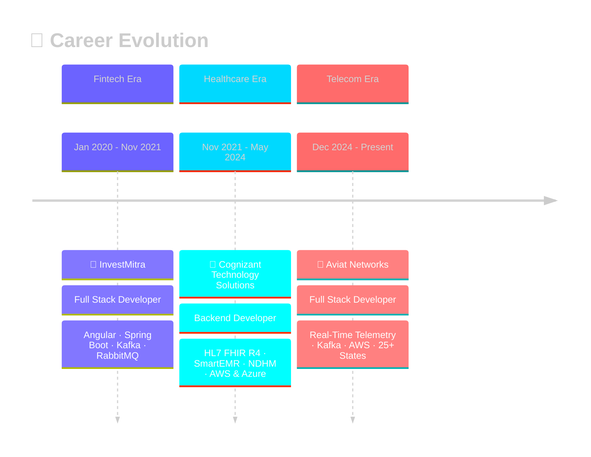

<div align="center">


[](https://git.io/typing-svg)

<br/>

<a href="mailto:reddieswaranaidusunycs@gmail.com"></a>
<a href="https://linkedin.com/in/YOUR_LINKEDIN"></a>
<a href="https://github.com/YOUR_GITHUB_USERNAME"></a>


<br/><br/>


</div>

---

<div align="center">


</div>

---

##  &nbsp;About Me

```js
const reddi = {
    pronouns: "he/him",
    location: "New Paltz, NY 🗽",
    currentRole: "Full Stack Developer @ Aviat Networks",
    education: "MS Computer Science — SUNY New Paltz (2025)",
    
    domains: {
        telecom:    "Real-time telemetry for 1000s of radios across 25+ U.S. states",
        healthcare: "HL7 FHIR R4-compliant platforms serving hospitals across India",
        fintech:    "Event-driven trading analytics & batch processing pipelines"
    },

    architecture: ["Microservices", "Event-Driven", "Domain-Driven Design", "Cloud-Native"],
    currentFocus: "Building resilient distributed systems that don't page me at 3 AM 😄",
    funFact: "I've shipped code that runs on radios in the African savanna 🌍"
};
```

---

##  &nbsp;Impact Dashboard

<div align="center">

<table>
<tr>
<td align="center" width="150">
<h1>40%</h1>
<sub><b>↓ OpEx Costs</b></sub>
</td>
<td align="center" width="150">
<h1>99.99%</h1>
<sub><b>Uptime SLA</b></sub>
</td>
<td align="center" width="150">
<h1>1M+</h1>
<sub><b>Users Served</b></sub>
</td>
<td align="center" width="150">
<h1>35%</h1>
<sub><b>↓ Downtime</b></sub>
</td>
</tr>
</table>

<table>
<tr>
<td align="center" width="150">
<h1>70%</h1>
<sub><b>↓ Manual Work</b></sub>
</td>
<td align="center" width="150">
<h1>95%+</h1>
<sub><b>Test Coverage</b></sub>
</td>
<td align="center" width="150">
<h1>100%</h1>
<sub><b>FHIR R4 Compliance</b></sub>
</td>
<td align="center" width="150">
<h1>25+</h1>
<sub><b>U.S. States</b></sub>
</td>
</tr>
</table>

<table>
<tr>
<td align="center" width="200">
<h3>⚡ Bi-weekly → Daily</h3>
<sub><b>Deployment Cadence</b></sub>
</td>
<td align="center" width="200">
<h3>📉 30-40% Faster</h3>
<sub><b>API Response Times</b></sub>
</td>
<td align="center" width="200">
<h3>🐛 20% Fewer</h3>
<sub><b>Defect Rates</b></sub>
</td>
<td align="center" width="200">
<h3>🚀 25% Faster</h3>
<sub><b>Dev Onboarding</b></sub>
</td>
</tr>
</table>

</div>

---

##  &nbsp;Tech Stack

<div align="center">

### ⚙️ Core Languages
<p>

</p>

### 🏗️ Backend & Frameworks
<p>

&nbsp;&nbsp;


</p>

### 🎨 Frontend
<p>

</p>

### ☁️ Cloud & Infrastructure
<p>

</p>
<p>


</p>

### 📨 Messaging & Event Streaming
<p>

&nbsp;&nbsp;

</p>

### 🗄️ Databases & Caching
<p>

&nbsp;&nbsp;


</p>

### 🔐 Security & Authentication
<p>


</p>

### 🔄 DevOps & CI/CD
<p>

</p>

### 📊 Monitoring & Observability
<p>

&nbsp;&nbsp;


</p>

### ✅ Testing & Quality
<p>


</p>

### 🤝 Tools & Collaboration
<p>

&nbsp;&nbsp;


</p>

</div>

---

##  &nbsp;Professional Journey

<div align="center">



</div>

<br/>

<details>
<summary><h3>📡 Aviat Networks — Full Stack Developer <code>Dec 2024 – Present</code></h3></summary>
<br/>

> **Domain:** Telecom &nbsp;|&nbsp; **Scale:** Thousands of radios, 25+ U.S. states &nbsp;|&nbsp; **Stack:** Spring Boot, Kafka, AWS, Docker, K8s

<table>
<tr><td>

**🎯 What I Built**
- Multi-tenant device management microservices for telemetry ingestion, alarm processing & user auth
- Kafka pipelines streaming real-time telemetry & alarms from thousands of field-deployed radios
- Intelligent alerting logic with cloud-based remote management across 25+ states
- Secure device provisioning via SNMP & NETCONF with AES-256, TLS & VPN tunnels

**📈 Impact Delivered**
- **↓ 35%** unplanned downtime through predictive maintenance workflows
- **↓ 40%** field maintenance costs via intelligent alerting
- **99.99%** uptime with event-driven architecture & AWS autoscaling
- **Bi-weekly → Daily** deployment cycles with Docker, Jenkins & K8s
- **↓ 30%+** API response times via PostgreSQL tuning & Redis caching
- **95%+** test coverage with JUnit, Mockito & Testcontainers
- **↓ 20%** defect rates through mentoring junior devs on backend best practices

</td></tr>
</table>
</details>

<details>
<summary><h3>🏥 Cognizant Technology Solutions — Backend Developer <code>Nov 2021 – May 2024</code></h3></summary>
<br/>

> **Domain:** Healthcare &nbsp;|&nbsp; **Scale:** Multi-hospital deployment across India &nbsp;|&nbsp; **Stack:** Spring Boot, PostgreSQL, Kafka, AWS, Azure

<table>
<tr><td>

**🎯 What I Built**
- Production-ready **SmartEMR** hospital platform — patient records, scheduling, prescriptions, billing, labs
- **HL7 FHIR R4-compliant** APIs using Java FHIR SDK for national health data interoperability
- Secure gateway for hospital ↔ NDHM data transmission with AES-256 & JSON Web Signatures
- OAuth2 PKCE + JWT auth for consent-driven data sharing aligned with India's digital health mission

**📈 Impact Delivered**
- **100%** FHIR R4 compliance — passed NDHM sandbox certification for production
- **↓ 70%** manual handling time across all hospital workflow modules
- **↓ 40%** faster data retrieval through advanced JPA query optimization
- **↑ 35%** transmission performance via Kafka async event logging
- **90%+** test coverage with JUnit & Mockito
- Dual-cloud deployment: **AWS** (SmartEMR) + **Azure** (NDHM Gateway)
- Platform adopted by hospitals with architecture designed for multi-institution scaling

</td></tr>
</table>
</details>

<details>
<summary><h3>🏦 InvestMitra — Full Stack Developer <code>Jan 2020 – Nov 2021</code></h3></summary>
<br/>

> **Domain:** Fintech &nbsp;|&nbsp; **Stack:** Angular 7, Spring Boot, Kafka, RabbitMQ, SQL Server, Oracle

<table>
<tr><td>

**🎯 What I Built**
- Angular 7 + Spring Boot fintech SPAs with reusable React UI modules
- High-throughput event streaming with Kafka + lightweight messaging with RabbitMQ
- Spring Batch orchestration for large-scale data processing jobs
- Hibernate/JPA persistence layers with query optimization across SQL Server & Oracle

**📈 Impact Delivered**
- Reduced message latency with real-time Kafka + RabbitMQ event pipelines
- Lowered average query execution time through Hibernate optimization
- Streamlined releases with Docker containers on AWS EC2 + S3 + RDS
- Centralized logging with SLF4J + ELK Stack for faster incident resolution
- Feature-branch Git workflow that reduced merge conflicts & accelerated releases

</td></tr>
</table>
</details>

---

##  &nbsp;System Design Philosophy

```
                        ┌──────────────────────────────────────────────────┐
                        │         HOW I BUILD PRODUCTION SYSTEMS           │
                        └──────────────┬───────────────────────────────────┘
                                       │
              ┌────────────────────────┼────────────────────────┐
              │                        │                        │
      ┌───────▼────────┐     ┌────────▼────────┐     ┌────────▼────────┐
      │   🧱 DESIGN     │     │   🔄 RUNTIME     │     │   🛡️ QUALITY    │
      ├────────────────┤     ├─────────────────┤     ├─────────────────┤
      │ Domain-Driven  │     │ Event-Driven    │     │ 95%+ Test       │
      │ Microservices  │     │ Kafka Streams   │     │ Coverage        │
      │ RESTful APIs   │     │ Async Messaging │     │ CI/CD Gates     │
      │ OpenAPI Specs  │     │ Auto-Scaling    │     │ Code Reviews    │
      └───────┬────────┘     └────────┬────────┘     └────────┬────────┘
              │                        │                        │
      ┌───────▼────────┐     ┌────────▼────────┐     ┌────────▼────────┐
      │   ☁️ INFRA      │     │   🔐 SECURITY   │     │   📊 OBSERVE    │
      ├────────────────┤     ├─────────────────┤     ├─────────────────┤
      │ AWS / Azure    │     │ OAuth2 + JWT    │     │ Prometheus      │
      │ Docker + K8s   │     │ AES-256 + TLS   │     │ Grafana + ELK  │
      │ IaC Pipelines  │     │ RBAC + VPN      │     │ CloudWatch      │
      └────────────────┘     └─────────────────┘     └─────────────────┘
```

---

## 🎓 Education & Certifications

<div align="center">


<br/>
<sub><b>SUNY New Paltz • May 2025</b></sub>

<br/><br/>


</div>

---

##  &nbsp;GitHub Analytics

<div align="center">


&nbsp;&nbsp;&nbsp;


<br/><br/>


<br/><br/>


</div>

---

## 🐍 Contribution Snake

<div align="center">

<picture>
  <source media="(prefers-color-scheme: dark)" srcset="https://raw.githubusercontent.com/YOUR_GITHUB_USERNAME/YOUR_GITHUB_USERNAME/output/github-snake-dark.svg" />
  <source media="(prefers-color-scheme: light)" srcset="https://raw.githubusercontent.com/YOUR_GITHUB_USERNAME/YOUR_GITHUB_USERNAME/output/github-snake.svg" />
  
</picture>

<sub>⬆️ Set up with <a href="https://github.com/Platane/snk">Platane/snk</a> GitHub Action to auto-generate</sub>

</div>

---

## 🌍 Where My Code Runs

```
🇺🇸 United States   ████████████████████  25+ States (Telecom Radios)
🇮🇳 India            ██████████████████    Multi-Hospital Networks (Healthcare)
🌍 Africa           ████████████          Telecom Operators
🌏 Asia             ████████████          Telecom Operators
```

---

<div align="center">


<br/><br/>

### 💬 *"I build systems that scale to millions — and sleep well knowing they won't break at 3 AM."*

<br/>


</div>
